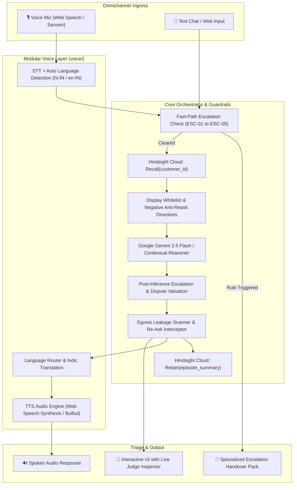

# 🏦 AI Banking Support: Financial Services & Schemes

> A production-grade, compliant AI customer support agent for banking and government financial schemes. Built with **Hindsight Cloud** per-customer memory banks, **deterministic non-LLM safety escalation**, **strict data entitlement guardrails**, and a **modular multilingual voice layer** (Web Speech + Indic Translation).

---

## 🏛️ Problem Statement & Invariants

When customers contact financial institutions about recurring issues (failed UPI mandates, loan disbursement delays, transaction disputes), they are forced to repeat identification and transaction details because support systems lack unified memory.

This agent enforces three strict operational invariants:
1. **Zero Information Redundancy**: Never ask customers for details already known in their verified Hindsight memory bank or active profile.
2. **Strict Data Entitlement Guardrails**: Never expose unapproved, unverified, or internal bank metrics (only fields flagged `approved_for_display: true` and `is_current: true` enter the model context).
3. **Deterministic, Non-LLM Escalation**: Safety and compliance triage decisions (repeated unresolved tickets $\ge$ 2, disputes $>$ ₹25,000 threshold, fraud alerts, explicit human requests) are evaluated deterministically—**readable and verifiable by judges in under 60 seconds**.

---

## 📐 Architecture Diagram



---

## ⚡ Deterministic Escalation Matrix (< 60s Judge Reference)

Located in [`app/escalation/rules.py`](file:///c:/Users/sriva/OneDrive/Documents/BANKING%20ASSISTANT/app/escalation/rules.py):

| Rule ID | Trigger Condition | Target Department | Priority | Judge-Verifiable Criteria |
| :--- | :--- | :--- | :--- | :--- |
| **`ESC-01`** | **Explicit human request** | Human Support Desk | `MEDIUM` | English & Hindi regex (`talk to agent`, `manager se baat karni hai`) |
| **`ESC-02A`** | **Active fraud alert** | Fraud & Cyber Risk Unit | `CRITICAL` | `fraud_alert_active: true` in core banking profile |
| **`ESC-02B`** | **Fraud keywords** | Fraud & Cyber Risk Unit | `CRITICAL` | `unauthorized`, `stolen card`, `hacked`, `phishing` |
| **`ESC-03`** | **High-value dispute** | Dispute & Chargeback Ops | `HIGH` | Disputed amount $\ge$ ₹25,000 / $500 threshold |
| **`ESC-04`** | **Repeated unresolved issues** | Human Support Desk | `HIGH` | $\ge$ 2 unresolved tickets in recalled Hindsight memory |
| **`ESC-05`** | **Regulatory threat** | Compliance & Ombudsman Desk | `CRITICAL` | `RBI Ombudsman`, `consumer court`, `legal notice` |

---

## 🚀 Quickstart & Setup

### 1. Requirements
- Python 3.10+ (tested on Python 3.14)
- Modern web browser (Chrome, Edge, Safari)

### 2. Install Dependencies
```bash
py -m pip install -r requirements.txt
```

### 3. Run Unit & Integration Tests (100% Pass in < 20ms)
```bash
py -m unittest discover tests
```

### 4. Start the Application
```bash
py -m uvicorn app.main:app --host 127.0.0.1 --port 8000
```
Open **[http://localhost:8000](http://localhost:8000)** in your browser.

---

## 🎬 Scripted Judge Demo Walkthrough

Use the 1-click **Judge Demo Paths** buttons at the top of the UI to execute each scenario:

### Path 1: Zero-Redundancy Memory ("Doesn't Repeat Questions")
- **Customer**: Aarav Sharma (`CUST-1001`), SME merchant
- **Inquiry**: *"What is the current status of my PM Mudra loan application?"*
- **What to Observe**:
  - The agent **never asks** for Aarav's Loan ID, Account Number, or Phone number.
  - Recalls his active application (`MUDRA-2026-8819`, ₹4,50,000 sanctioned, disbursement on 02-10-2026) directly from Hindsight memory.
  - In the **Judge Inspector (Right Panel)**, observe that internal bank metrics (`cibil_internal_band`, `internal_risk_score`) are **blocked from display**.

### Path 2: Deterministic Escalation (Rule `ESC-04`)
- **Customer**: Priya Patel (`CUST-1002`), Salaried professional
- **Inquiry**: *"My mutual fund SIP auto-debit failed again this month!"*
- **What to Observe**:
  - Hindsight recalls 2 previous unresolved tickets (`TCK-2026-091`, `TCK-2026-114`) with `U19_MANDATE_TIMEOUT`.
  - Trips **Rule `ESC-04` (Repeated Unresolved Issues $\ge$ 2)**.
  - Escalates immediately to **Human Support Desk** with **`HIGH` Priority**, passing all context forward so the customer doesn't have to explain again.

### Path 3: High-Value Financial Dispute (Rule `ESC-03`)
- **Customer**: Vikram Malhotra (`CUST-1003`), Platinum Wealth Cardholder
- **Inquiry**: *"I want to dispute a transaction charge of ₹48,500 on my credit card in Dubai!"*
- **What to Observe**:
  - Extracted dispute amount (₹48,500) exceeds the ₹25,000 threshold.
  - Automatically routes to **Dispute & Chargeback Ops** under RBI TAT charter with chargeback logging.

### Path 4: Multilingual Voice & Government Scheme Guidance
- **Customer**: Sunita Devi (`CUST-1004`), Street vendor / Rural entrepreneur
- **Inquiry (Voice / Hindi)**: *"मेरा स्वनिधि का अगला लोन कब मिलेगा?"* (When will I get my next PM SVANidhi loan?)
- **What to Observe**:
  - Speech recognized via Web Speech API in Hindi (`hi-IN`).
  - Hindsight confirms first tranche of ₹10,000 was repaid 100% on time.
  - Agent confirms eligibility for 2nd tranche of ₹20,000 and explains the 7% interest subsidy directly in Hindi.
  - Auto-TTS speaks back the response in natural, fluent Hindi.

---

## 📂 Project Structure

```
BANKING ASSISTANT/
├── app/
│   ├── main.py                     # FastAPI application & REST endpoints
│   ├── orchestrator.py             # Central pipeline orchestrator
│   ├── memory/
│   │   ├── hindsight_client.py     # Dual-mode Hindsight Cloud client (Live + In-Memory)
│   │   └── models.py               # Retain, Recall, Reflect schemas
│   ├── escalation/
│   │   ├── rules.py                # Deterministic rule engine (<60s judge-readable)
│   │   └── models.py               # Escalation verdicts, priorities, departments
│   ├── guardrails/
│   │   ├── display_filter.py       # approved_for_display / is_current whitelist
│   │   ├── anti_reask.py           # Anti-redundancy prompt constraints & interceptor
│   │   └── guardrail_manager.py    # Unified compliance manager
│   ├── voice/
│   │   ├── stt_adapter.py          # Speech-to-Text & auto language detection
│   │   ├── tts_adapter.py          # Text-to-Speech & Indic alignment
│   │   ├── language_router.py      # Translation fallback
│   │   └── voice_handler.py        # Dedicated voice wrapper around core pipeline
│   ├── data/
│   │   ├── mock_customers.json     # 5 diverse personas with approved & internal fields
│   │   ├── schemes_catalog.json    # PM Mudra, SVANidhi, Stand-Up India, PMAY
│   │   └── mock_db.py              # In-memory query and repository layer
│   └── web/
│       ├── index.html              # Modern, beautiful 3-column judge dashboard
│       ├── app.js                  # Frontend client with Web Speech API integration
│       └── styles.css              # Fintech UI styling with audio waves
├── tests/
│   ├── test_orchestrator.py        # End-to-end integration tests
│   ├── test_escalation.py          # Deterministic rule verification tests
│   ├── test_guardrails.py          # Display whitelist & anti-reask tests
│   └── test_voice.py               # Voice STT/TTS adapter tests
├── requirements.txt
├── .env.example
└── README.md
```
